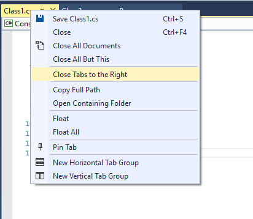

# CloseTabsToRight

<!-- Update the VS Gallery link after you upload the VSIX-->
Download this extension from the [VS Gallery](https://visualstudiogallery.msdn.microsoft.com/0da1748d-6967-445f-b61b-7c447f3f4107)
or get the [CI build](http://vsixgallery.com/extension/ee6375e5-ed09-4fba-a897-895813190958/).

---------------------------------------

Close document tabs to the right of the current document.

See the [changelog](CHANGELOG.md) for changes and roadmap.

## Features

- Close all tabs to the right of the current document.

### Close tabs to the right of the current document
Right-click on the current document's tab and select *Close Tabs to the Right* to close all tabs to the right.

## Contribute
Check out the [contribution guidelines](CONTRIBUTING.md)
if you want to contribute to this project.

For cloning and building this project yourself, make sure
to install the
[Extensibility Tools 2015](https://visualstudiogallery.msdn.microsoft.com/ab39a092-1343-46e2-b0f1-6a3f91155aa6)
extension for Visual Studio which enables some features
used by this project.

## License
[Apache 2.0](LICENSE)